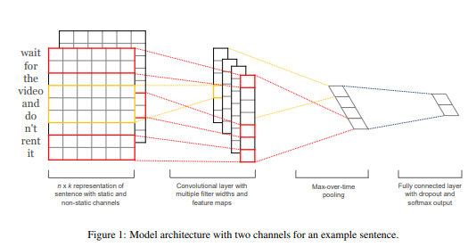
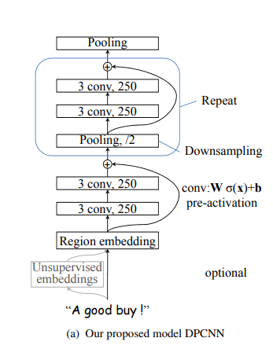
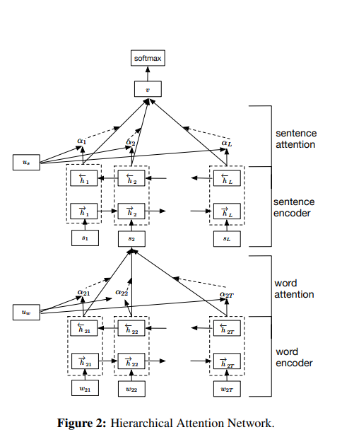

# 文本分类模型
## 模型
### TextCNN

### dpCNN

### Han

### c_GRU

## 方法
### 数据预处理

- ltp分词，ltp词性标注及命名实体识别，去掉人名地名机构名
- 删除日期、替换罚款金额

### 单模型
- 训练过程中存每个任务最好的模型，预测时进行选择或取均值融合

### 多模型
- 多个模型取均值或采取投票的方式预测结果

## 超参设置

| batch_size | keep_dropout | sentence_len | embed_size | hidden_size | num_min_example |
|---|---|---|---|---|---|
| 256 | 0.5 | 400 | 64 | 256 | 5000 |

## 实验结果
### 单模型

| 模型 | small data |罪名| 法条 | 刑期 | big data | 罪名 | 法条  | 刑期 |
|---|---|---|---|---|---|---|---|---|
| textcnn |  | 90.29 | 86.26 | 55.4 | | 88.56 | 80.43 | 67.37 |
| dpcnn |  | 58.33 |57.91 | 48.19 |  | 91.16 | 88.87  | 68.28|
| han|  | 83.44 | 80.47 | 51.59 |  | 84.8 | 83.36  | 65.36|
| c_gru |  | 68.32 | 67.76 | 48.41 |  | 88.88 | 85.87  |69.47|

### 模型融合

| 融合 | 罪名 | 法条 | 刑期 |
|---|---|---|---|
| textcnn | 89.24 | 86.74 | 69.45 |
| dpcnn | 91.37 | 88.78 | 68.78 |
| textcnn+han | 88.45 | 86.33 | 66.79 |
| textcnn+han vote | 88.69 | 84.18 | 68.64 |
| textcnn+dpcnn | 89.89| 83.79 | 69.78 |
| textcnn+dpcnn vote| 90.68 | 88.17 | 69.78 |
| textcnn+dpcnn+cgru | 89.08 | 83.83 | 69.66 |
|textcnn+dpcnn+cgru vote|88.98|86.69|69.66|
说明：融合中的单模型是以在训练过程中，每个任务保存得分最高的模型融合的结果（实际只有前两个任务的）

### 线上结果

| 模型 | 罪名 | 法条 | 刑期 |
|---|---|---|---|
| BiDAF | 69.09 | 12.96 | 41.91 |
| textcnn | 81.14 | 78.26 | 45.94 |
| dpcnn | 80.26 | 78.13 | 67.48 |
| textcnn fuse | 84.45 | 81.94 | 67.69 |
| textcnn han vote | 84.29 | 79.35 | 67.06 |
| textcnn dpcnn vote | 84.5 | 80.35 | 67.42 |
| textcnn dpcnn cgru vote| 83.41 | 80.73 | 67.48 |

## 参考
1. [TextCNN:Convolutional Neural Networks for Sentence Classification](https://arxiv.org/pdf/1408.5882v2.pdf)
2. [Deep Pyramid Convolutional Neural Networks for Text Categorization](http://www.aclweb.org/anthology/P/P17/P17-1052.pdf)
3. [Hierarchical Attention Networks for Document Classification](http://www.aclweb.org/anthology/P/P17/P17-1052.pdf)
4. [CAIL2018: A Large-Scale Legal Dataset for Judgment Prediction](https://arxiv.org/pdf/1807.02478.pdf)

