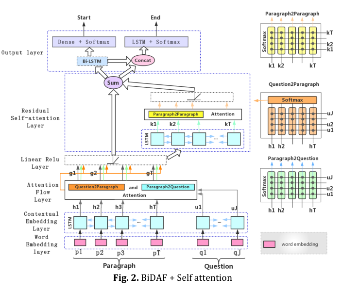

# "中国法研杯"司法人工智能挑战赛数据说明

## 一、简介

法律智能旨在赋予机器阅读理解法律文本与定量分析案例的能力，完成罪名预测、法律条款推荐、刑期预测等具有实际应用需求的任务，有望辅助法官、律师等人士更加高效地进行法律判决。近年来，以深度学习和自然语言处理为代表的人工智能技术取得巨大突破，也开始在法律智能领域崭露头角，受到学术界和产业界的广泛关注。

为了促进法律智能相关技术的发展，在最高人民法院信息中心、共青团中央青年发展部的指导下，中国司法大数据研究院、中国中文信息学会、中电科系统团委联合清华大学、北京大学、中国科学院软件研究所共同举办“2018中国‘法研杯’法律智能挑战赛（[CAIL2018](http://180.76.238.177)）”。挑战赛将提供海量的刑事法律文书数据作为数据集，旨在为研究者提供学术交流平台，推动语言理解和人工智能领域技术在法律领域的应用，促进法律人工智能事业的发展。每年比赛结束后将举办技术交流和颁奖活动。诚邀学术界和工业界的研究者和开发者积极参与该挑战赛！

## 二、任务说明

### 2.1 介绍

* 任务一（罪名预测）：根据刑事法律文书中的案情描述和事实部分，预测被告人被判的罪名；
* 任务二（法条推荐）：根据刑事法律文书中的案情描述和事实部分，预测本案涉及的相关法条；
* 任务三（刑期预测）：根据刑事法律文书中的案情描述和事实部分，预测被告人的刑期长短。

参赛者可选择一个或者多个任务参与挑战赛。同时，为了鼓励参赛者参与到更多的任务中，组委会将单独奖励参与更多任务的参赛者。

### 2.2 数据介绍

本次挑战赛所使用的数据集是来自“[中国裁判文书网](http://wenshu.court.gov.cn/)”公开的刑事法律文书，其中每份数据由法律文书中的案情描述和事实部分组成，同时也包括每个案件所涉及的法条、被告人被判的罪名和刑期长短等要素。

数据集共包括`268万刑法法律文书`，共涉及[202条罪名](meta/accu.txt)，[183条法条](meta/law.txt)，刑期长短包括**0-25年、无期、死刑**。

我们将先后发布CAIL2018-Small和CAIL2018-Large两组数据集。CAIL2018-Small包括19.6万份文书样例，直接在该网站发布，包括15万训练集，1.6万验证集和3万测试集。这部分数据可以[注册下载](http://cail.cipsc.org.cn)，供参赛者前期训练和测试。

比赛开始2-3周后（具体时间请关注比赛新闻），我们将通过网络下载向有资格的参赛队伍定向发布CAIL2018-Large数据集，包括150万文书样例。最后，剩余90万份文书将作为第一阶段的测试数据CAIL2018-Large-test。

#### 2.2.1 字段及意义
数据利用json格式储存，每一行为一条数据，每条数据均为一个字典。

* **fact**: 事实描述  
* **meta**: 标注信息，标注信息中包括:   
    * **criminals**: 被告(数据中均只含一个被告)  
    * **punish\_of\_money**: 罚款(单位：元)
    * **accusation**: 罪名  
    * **relevant\_articles**: 相关法条  
    * **term\_of\_imprisonment**: 刑期  
        刑期格式(单位：月)
        * **death\_penalty**: 是否死刑  
        * **life\_imprisonment**: 是否无期
        * **imprisonment**: 有期徒刑刑期

```
这里是简单的一条数据展示:  
{   
	"fact": "2015年11月5日上午，被告人胡某在平湖市乍浦镇的嘉兴市多凌金牛制衣有限公司车间内，与被害人孙某因工作琐事发生口角，后被告人胡某用木制坐垫打伤被害人孙某左腹部。经平湖公安司法鉴定中心鉴定：孙某的左腹部损伤已达重伤二级。",   
	"meta": 
	{  
		"relevant_articles": [234],  
		"accusation": ["故意伤害"], 
		"criminals": ["段某"],  
		"term_of_imprisonment": 
		{  
			"death_penalty": false,  
			"imprisonment": 12,  
			"life_imprisonment": false
		}
	}
}
```

### 2.3 评价方法

本次挑战赛使用的数据集均为来自中国裁判文书网上的刑事法律文书，标准答案是案件的判决结果。我们提供了评测时使用的评分程序共选手使用，评测方法、环境和模型提交说明请看[链接](https://github.com/thunlp/CAIL2018)

每项任务满分100分，下面将对三项任务的评价方法分别进行说明：

#### 2.3.1 任务一、任务二

任务一（罪名预测）、任务二（法条推荐）两项任务将采用分类任务中的微平均F1值（Micro-F1-measure）和宏平均F1值（Macro-F1-measure）作为评价指标，其计算方式为：


则任务的最终分数为：


#### 2.3.2 任务三

任务三（刑期预测）将采用下列公式，根据预测出的刑期与案件标准刑期之间的差值距离作为评价指标。设预测出的刑期为`lp`，标准答案为`la`，则


```
若v≤0.2，则score=1；
若0.2<v≤0.4，则score=0.8
……
以此类推。
```
**特殊的情况**

若案件刑期的标准答案为**死刑**则`lp=-2`， **无期**则`lp=-1`，才计分。具体请见[评测部分源码](https://github.com/thunlp/CAIL2018/blob/a258c1dae88e8fc576529e6dcb012a430da00b95/judger/judger.py#L90)。

最后，将任务三所有测试点的分数相加并除以测试点总数乘以100作为任务三的评价得分：


#### 2.3.3 三项任务总分的计算方式

每个任务的满分均为100，则总分为：


### 2.4 基线系统

竞赛组织方提供了一个开源的针对不同任务的基线系统（[LibSVM](https://github.com/thunlp/CAIL2018/tree/master/baseline)）。

## 线上python3.5系统环境

```
Package             Version               
------------------- ----------------------
absl-py             0.2.0                 
astor               0.6.2                 
bleach              1.5.0                 
boto                2.48.0                
boto3               1.7.19                
botocore            1.10.19               
bz2file             0.98                  
certifi             2018.4.16             
chardet             3.0.4                 
cycler              0.10.0                
Cython              0.28.2                
docutils            0.14                  
fasttext            0.8.3                 
future              0.16.0                
gast                0.2.0                 
gensim              3.4.0                 
grpcio              1.11.0                
h5py                2.7.1                 
html5lib            0.9999999             
idna                2.6                   
jieba               0.39                  
jmespath            0.9.3                 
JPype1              0.6.3                 
Keras               2.1.6                 
kiwisolver          1.0.1                 
lightgbm            2.1.1                 
Mako                1.0.7                 
Markdown            2.6.11                
MarkupSafe          1.0                   
matplotlib          2.2.2                 
numpy               1.14.3                
pandas              0.22.0                
Pillow              5.1.0                 
pip                 10.0.1                
protobuf            3.5.2.post1           
pycurl              7.43.0                
pygobject           3.20.0                
pygpu               0.7.6                 
pyhanlp             0.1.41                
pyltp               0.2.1                 
pyparsing           2.2.0                 
python-apt          1.1.0b1+ubuntu0.16.4.1        
pytz                2018.4                
PyYAML              3.12                  
requests            2.18.4                
s3transfer          0.1.13                
scikit-learn        0.19.1                
scikit-multilearn   0.0.5                 
scipy               1.1.0                 
seq2seq             0.1.5                 
setuptools          39.0.1                
six                 1.11.0                
sklearn             0.0                   
smart-open          1.5.7                 
tensorboard         1.7.0                 
tensorflow-gpu      1.7.0                 
termcolor           1.1.0                 
tflearn             0.3.2                 
Theano              1.0.1                 
thulac              0.1.2                 
torch               0.3.1                 
torchtext           0.2.3                 
torchvision         0.2.0                 
tqdm                4.23.3                
unattended-upgrades 0.1                   
urllib3             1.22                  
Werkzeug            0.14.1                
wheel               0.31.0                
xgboost             0.71
```
## 三、我的解决方案
### 3.1 [BiDAF模型](https://github.com/jingyihiter/mycail/tree/master/mycail)应用于文本分类任务


### 3.2 [文本分类模型](https://github.com/jingyihiter/mycail/tree/master/ai_law)
textcnn
dpcnn
han
c_gru


